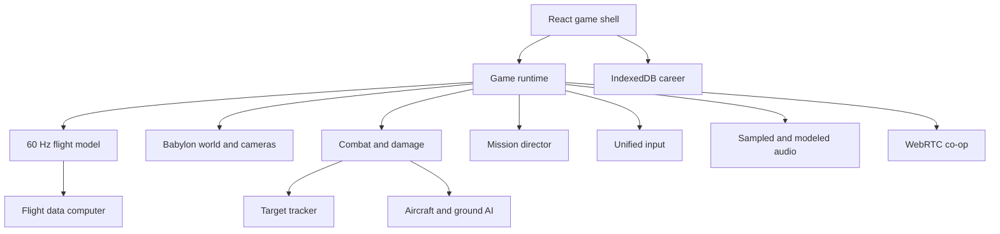

# Architecture

RotorFrontier is organized as a browser-only simulation client. The current co-op
mode is peer-to-peer and career data is origin-local, so the deployed game does not
need an application database or gameplay server.

## Runtime ownership

`GameShell.tsx` owns menus, settings, career persistence, connection signaling,
HUD state, and the lifecycle of `GameRuntime`. `GameRuntime` owns one sortie. It
creates the renderer and scene, then coordinates simulation systems while keeping
React updates off the hot path. Telemetry is sampled at 12.5 Hz rather than once
per render frame.

## Simulation loop

Rendering follows the display refresh rate, while flight, AI, weapons, objectives,
and networking are updated from a capped accumulator in fixed 1/60-second steps.
The frame delta is clamped and the accumulator is bounded to prevent a background
tab from causing an unbounded catch-up spiral.

The custom flight model integrates:

- collective-dependent rotor lift and rotor-RPM energy;
- cyclic and anti-torque angular rates;
- density, translational-lift, and near-ground multipliers;
- quadratic air drag, wind coupling, gravity, and rotor-disc tilt translation;
- terrain contact, impact energy, airframe damage, and power degradation;
- default velocity-command flight assistance with hold-to-climb vertical control,
  hover capture, automatic levelling, and automatic horizontal braking;
- a runtime-toggleable advanced mode retaining persistent collective, direct cyclic,
  aerodynamic translation, and slower anti-torque response.

This is a game flight model, not a certified engineering simulator. Coefficients are
tuned for readable handling and mission pacing while preserving important control
relationships documented in FAA rotorcraft material.

## World and renderer

`WorldBuilder` asynchronously prepares a georeferenced 8.2 km Nairobi theatre before
spawning simulation entities. `RealTerrain` resolves the 3 × 3 XYZ tile neighbourhood
around -1.286389, 36.817223 at zoom 13, decodes the provider's RGB DEM into metres,
and exposes one bilinear `terrainHeight(x, z)` sampler to flight contact, AI terrain
clearance, weapon collision, spawning, and rendering. The same local bounds crop and
drape the matching map imagery over the Babylon mesh. This keeps Babylon coordinates
small while telemetry altitude remains mean-sea-level height.

The default source is public Mapzen Terrarium elevation from the AWS Open Data
Registry plus policy-compliant OpenStreetMap standard tiles, so real terrain works
without a credential. Settings can select MapTiler or Mapbox Terrain RGB and
satellite imagery when the player supplies a public browser token. Provider failure
falls back to the open source, then to the deterministic procedural theatre if all
tile requests fail. Tokens are stored only in the browser's local settings.

Thin-instanced vegetation, outposts, helipad, and mission beacons remain game-owned
layers above the terrain. A time-of-day model updates sun, ambient intensity, sky,
fog, precipitation, and gusting wind. Babylon.js selects WebGPU where available and
falls back to WebGL 2. High quality enables 2K filtered shadows, FXAA, bloom, and
enhanced vegetation density; auto quality uses device memory and logical processor
count as conservative hints.

The player airframe uses asynchronously loaded, web-optimized GLBs. High quality
loads the 15.15 MB presentation asset, while low quality loads a 7.19 MB performance
LOD instead of reverting to the old primitive model. Imported bounds are normalized
to the AH-64E's published rotor diameter, attached to the simulation root, and
animated by re-parenting the source model's blade meshes around measured main and tail
rotor hubs. No synthetic rotor discs are rendered. The procedural airframe now appears
only after an asset-load failure, so every normal quality tier presents an Apache. The
same high-detail asset powers an isolated interactive Babylon scene in the hangar. Asset
authorship, license, and transformations are recorded in `docs/ASSET_LICENSES.md`.

## Audio

Three compact licensed samples provide the rotor, M230 cannon, and rocket-launch
foundation. `AudioSystem` fetches and decodes them after the launch gesture, then
routes all voices through a master dynamics compressor. Rotor pitch, filtering, and
gain respond continuously to RPM, collective, and airspeed. Weapon voices use timed
gain envelopes, randomized pitch where appropriate, and procedural low-frequency
layers. Impact and explosion synthesis is retained, and every sampled voice has a
procedural fallback if loading or decoding fails.

## AI and combat

Each hostile aircraft has a patrol phase, engagement range, desired orbit, velocity
controller, terrain-clearance floor, lead solution, weapon cooldown, and health.
Ground forces move or hold based on role. SAMs launch guided threats; armour uses
direct fire. All entities implement a small `CombatTarget` interface, allowing the
weapon system to perform target selection and collision without coupling to meshes.

Player weapons use pooled lifecycle arrays with explicit disposal. Hellfires steer
toward a live target, Hydras follow gravity-biased ballistics, and cannon rounds use
high-speed traces. Swept segment/sphere tests prevent fast rounds from tunnelling
between fixed updates. Damage is component-aware for the player and health-based for AI.

`TargetTracker` owns target selection and track state independently of rendering.
Contacts must be alive, in sensor range, within the sensor field of regard, and clear
of sampled terrain. Valid signal increases track quality through acquiring and
tracking to locked; masking or leaving the field causes a timed coast and decay rather
than an immediate disappearance. The track computer derives closure, bearing,
relative azimuth, elevation, target health, and a cannon intercept point. Hellfire
launch authorization reads the same lock state shown to the player.

`FlightDataComputer` runs in the fixed simulation loop and derives air-relative TAS,
ground speed/track, drift, vertical speed, attitude, turn rate, smoothed normal load,
mode, modeled torque/power margin/endurance, and waypoint bearing/range/ETE. React
receives a coherent snapshot with the rest of the 12.5 Hz telemetry. Target and lead
positions are projected from the active Babylon camera into normalized HUD space.
Combat hits and incoming impacts bypass the slower telemetry sampler through short
event callbacks, ensuring every confirmation and directional damage cue is visible.

## Networking

Co-op uses two `RTCDataChannel` instances:

| Channel | Delivery | Use |
|---|---|---|
| `state` | unordered, `maxRetransmits: 0` | 15 Hz pose, velocity, rotor, hull |
| `events` | ordered, reliable | cannon, rocket, missile, and notice events |

Incoming payloads are schema-validated with Zod before entering runtime state.
Remote poses are interpolated, not snapped. State sends are dropped when the data
channel buffer exceeds 48 KB to favor current state over stale queued snapshots.
Offer/answer signaling is encoded into URL-safe text for manual exchange.

The production-alpha topology is intentionally two-peer and client-simulated. A
future authoritative host protocol should own AI state, mission completion, damage,
late joins, and reconnection; a TURN service is also needed for universal NAT reach.

## Persistence and offline behavior

Career profiles are validated, versioned objects stored asynchronously in IndexedDB
through `idb-keyval`, with `localStorage` as a fallback. Settings use local storage.
A small network-first service worker caches same-origin responses and supplies the
last known shell when offline. Clearing site data resets career and cached assets.

## Security boundaries

- Network and save payloads are schema-checked before use.
- The game never accepts arbitrary code, HTML, or asset URLs from a peer.
- Co-op descriptions can expose network candidates and should be shared only with
  the intended wingman.
- There is no authentication, competitive ranking, payment, or server-trusted state
  in this milestone.
