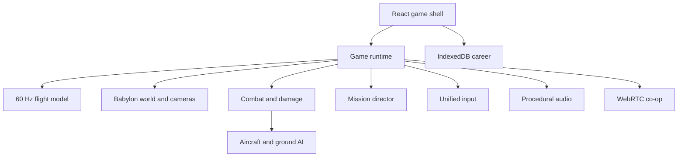

# Architecture

RotorFrontier is organized as a browser-only simulation client. The current co-op
mode is peer-to-peer and career data is origin-local, so the deployed game does not
need an application database or gameplay server.

## Runtime ownership

`GameShell.tsx` owns menus, settings, career persistence, connection signaling,
HUD state, and the lifecycle of `GameRuntime`. `GameRuntime` owns one sortie. It
creates the renderer and scene, then coordinates simulation systems while keeping
React updates off the hot path. Telemetry is sampled at 12.5 Hz rather than once
per render frame.

## Simulation loop

Rendering follows the display refresh rate, while flight, AI, weapons, objectives,
and networking are updated from a capped accumulator in fixed 1/60-second steps.
The frame delta is clamped and the accumulator is bounded to prevent a background
tab from causing an unbounded catch-up spiral.

The custom flight model integrates:

- collective-dependent rotor lift and rotor-RPM energy;
- cyclic and anti-torque angular rates;
- density, translational-lift, and near-ground multipliers;
- quadratic air drag, wind coupling, gravity, and forward thrust;
- terrain contact, impact energy, airframe damage, and power degradation;
- optional attitude-rate damping for an accessible hybrid-realism mode.

This is a game flight model, not a certified engineering simulator. Coefficients are
tuned for readable handling and mission pacing while preserving important control
relationships documented in FAA rotorcraft material.

## World and renderer

`WorldBuilder` creates a deterministic 8.2 km terrain mesh, thin-instanced forest,
river, outposts, helipad, and mission beacon. A time-of-day light model updates sun,
ambient intensity, sky, fog, precipitation, and gusting wind. Babylon.js selects
WebGPU where available and falls back to WebGL 2. High quality enables 2K filtered
shadows, FXAA, bloom, and enhanced vegetation density; auto quality uses device
memory and logical processor count as conservative hints.

## AI and combat

Each hostile aircraft has a patrol phase, engagement range, desired orbit, velocity
controller, terrain-clearance floor, lead solution, weapon cooldown, and health.
Ground forces move or hold based on role. SAMs launch guided threats; armour uses
direct fire. All entities implement a small `CombatTarget` interface, allowing the
weapon system to perform target selection and collision without coupling to meshes.

Player weapons use pooled lifecycle arrays with explicit disposal. Hellfires steer
toward a live target, Hydras follow gravity-biased ballistics, and cannon rounds use
high-speed traces. Damage is component-aware for the player and health-based for AI.

## Networking

Co-op uses two `RTCDataChannel` instances:

| Channel | Delivery | Use |
|---|---|---|
| `state` | unordered, `maxRetransmits: 0` | 15 Hz pose, velocity, rotor, hull |
| `events` | ordered, reliable | cannon, rocket, missile, and notice events |

Incoming payloads are schema-validated with Zod before entering runtime state.
Remote poses are interpolated, not snapped. State sends are dropped when the data
channel buffer exceeds 48 KB to favor current state over stale queued snapshots.
Offer/answer signaling is encoded into URL-safe text for manual exchange.

The production-alpha topology is intentionally two-peer and client-simulated. A
future authoritative host protocol should own AI state, mission completion, damage,
late joins, and reconnection; a TURN service is also needed for universal NAT reach.

## Persistence and offline behavior

Career profiles are validated, versioned objects stored asynchronously in IndexedDB
through `idb-keyval`, with `localStorage` as a fallback. Settings use local storage.
A small network-first service worker caches same-origin responses and supplies the
last known shell when offline. Clearing site data resets career and cached assets.

## Security boundaries

- Network and save payloads are schema-checked before use.
- The game never accepts arbitrary code, HTML, or asset URLs from a peer.
- Co-op descriptions can expose network candidates and should be shared only with
  the intended wingman.
- There is no authentication, competitive ranking, payment, or server-trusted state
  in this milestone.
